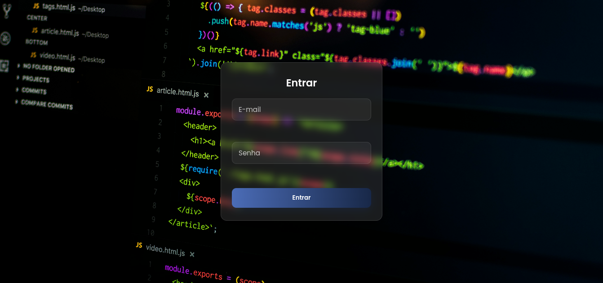

# Caixa de Login (Transparente)

## Visualizar



## Descrição

Pequeno projeto de aprendizado que implementa uma caixa de login centralizada com efeito de transparência, sombra e bordas arredondadas. Inclui validação básica em JavaScript para os campos de e‑mail e senha.

## Tecnologias

- `HTML5`
- `CSS3` (com `backdrop-filter` para desfoque de fundo)
- `JavaScript` (validação do formulário)

## Como executar (teste local)

1. Abra um terminal na pasta do projeto:

```
cd "/media/extra/Programação - pratica/Aprendendo/pratica/projetos/PTR - 10 - Caixa de login"
```

2. Inicie um servidor HTTP simples:

```bash
python3 -m http.server 8000
```

3. Abra no navegador: `http://localhost:8000/`

## Estrutura de arquivos

- `index.html` — markup principal com a estrutura da caixa de login.
- `assets/CSS/style.css` — estilos do projeto (fundo, card, inputs, botão e mensagens de erro).
- `assets/JS/script.js` — validação do formulário (email e senha) e simulação de envio.
- `assets/images/` — imagens (ex.: `background.jpg`) usadas como plano de fundo.
- `README.md` — esta documentação.

## Funcionalidades

- Caixa de login centralizada com fundo parcialmente transparente e desfoque (`backdrop-filter`).
- Bordas arredondadas e sombra para destacar o card.
- Validação em JavaScript:
    - Campo `E-mail`: obrigatório e formato válido.
    - Campo `Senha`: obrigatório e mínimo de 6 caracteres.
    - Foco automático no primeiro campo inválido.
    - Simulação de envio com texto temporário no botão.

## Personalização rápida

- Para alterar a opacidade do card, edite o `background` em `assets/CSS/style.css` na classe `.login-card`.
- Para mudar o desfoque, altere `backdrop-filter: blur(8px);`.
- Para cores do botão, ajuste `background` em `.btn-login`.

## Próximos passos (sugestões)

- Substituir o `alert` por um banner de sucesso inline.
- Implementar chamadas reais a uma API de autenticação (fetch/axios).
- Adicionar testes unitários para validação.

## Contribuição

Pull requests são bem-vindos — abra uma issue primeiro para discutir mudanças maiores.

## Licença

Use livremente para fins de estudo e aprendizado.
